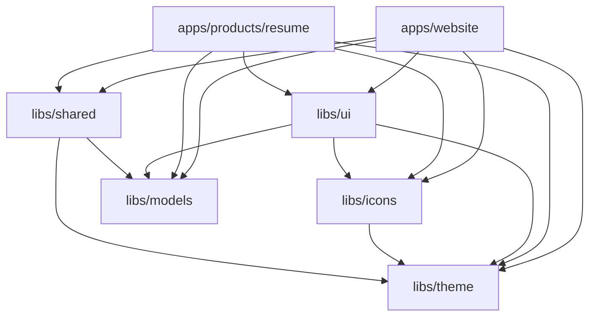
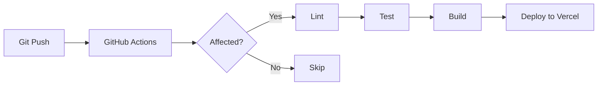

# 🏗 Architecture

> Technical architecture overview for the Fzyrk platform.

---

## Table of Contents

- [Overview](#overview)
- [Architectural Principles](#architectural-principles)
- [Monorepo Architecture](#monorepo-architecture)
- [Application Architecture](#application-architecture)
- [Library Architecture](#library-architecture)
- [Routing Architecture](#routing-architecture)
- [State Management](#state-management)
- [Design System Architecture](#design-system-architecture)
- [Build & Deployment](#build--deployment)
- [Security](#security)
- [Performance Strategy](#performance-strategy)
- [Future Architecture (Backend)](#future-architecture-backend)

---

## Overview

Fzyrk is built as an **Nx Angular monorepo** that houses multiple applications and shared libraries under a single repository. This architecture enables:

- **Code sharing** across all products via shared libraries
- **Consistent design** through a centralized design system
- **Independent deployability** for each product app
- **Incremental builds** with Nx's computation caching
- **Enforced boundaries** between library scopes

```
┌─────────────────────────────────────────────────────────┐
│                     Vercel (CDN)                        │
├─────────────────────────────────────────────────────────┤
│                   Angular SPA Shell                     │
│              (apps/website — fzyrk.com)                 │
├───────────┬───────────┬───────────┬─────────────────────┤
│  /        │ /about    │ /blog     │ /products/*         │
│  Home     │ About     │ Blog      │ Product Apps        │
│  Page     │ Page      │ Page      │ (lazy loaded)       │
├───────────┴───────────┴───────────┴─────────────────────┤
│                                                         │
│  ┌──────────┐  ┌──────────┐  ┌──────────┐              │
│  │ libs/ui  │  │libs/theme│  │libs/icons│              │
│  │          │  │          │  │          │              │
│  │ Fzyrk UI │  │  Design  │  │   Icon   │              │
│  │Components│  │  Tokens  │  │  System  │              │
│  └──────────┘  └──────────┘  └──────────┘              │
│                                                         │
│  ┌──────────┐  ┌──────────┐                             │
│  │libs/     │  │libs/     │                             │
│  │shared    │  │models    │                             │
│  │          │  │          │                             │
│  │Utilities │  │TypeScript│                             │
│  │Directives│  │Interfaces│                             │
│  └──────────┘  └──────────┘                             │
└─────────────────────────────────────────────────────────┘
```

---

## Architectural Principles

| Principle | Description |
|---|---|
| **Standalone Components** | All components are standalone — no NgModules. Simplifies dependency management and enables tree-shaking. |
| **Signals-First** | Use Angular Signals (`signal()`, `computed()`, `effect()`, `input()`, `output()`, `model()`) as the primary reactivity model. RxJS only for async streams (HTTP, events). |
| **Smart/Dumb Pattern** | Pages are "smart" (contain logic, inject services). Components are "dumb" (receive inputs, emit outputs). |
| **Lazy Loading** | Every route except the home page is lazy-loaded via `loadComponent()` or `loadChildren()`. |
| **Feature-First Organization** | Code is organized by feature (page/component), not by type (all services in one folder). |
| **Library Boundaries** | Nx enforces import boundaries — apps can import libs, but libs cannot import apps. Libs are layered: `models` → `theme` → `icons` → `shared` → `ui`. |
| **Barrel Exports** | Every library exposes a public API via `index.ts`. Internal files are not directly importable. |
| **CSS Custom Properties** | All styling uses CSS custom properties (design tokens) from `libs/theme`. No hardcoded colors, sizes, or shadows. |

---

## Monorepo Architecture

### Nx Workspace

```
nx.json                     → Nx workspace configuration
tsconfig.base.json          → Base TypeScript config (all projects inherit)
package.json                → Root dependencies
angular.json / project.json → Per-project build/test/lint config
```

### Project Graph



### Library Dependency Layers

```
Layer 0 (Foundation):   libs/models     → No dependencies
Layer 1 (Tokens):       libs/theme      → No lib dependencies (CSS only)
Layer 2 (Icons):        libs/icons      → libs/theme (for sizing tokens)
Layer 3 (Utilities):    libs/shared     → libs/theme, libs/models
Layer 4 (Components):   libs/ui         → libs/theme, libs/icons, libs/models
Layer 5 (Apps):         apps/*          → Any lib
```

---

## Application Architecture

### Website App (`apps/website`)

The marketing website and application shell. Owns the root `<router-outlet>` and provides the global navbar/footer layout.

```
apps/website/src/app/
├── app.ts                  → Root component: <fz-navbar> + <router-outlet> + <fz-footer>
├── app.routes.ts           → Master route config (marketing + /products/*)
├── pages/
│   ├── home/               → Landing page (hero, products, roadmap, stats)
│   ├── about/              → Company story, mission, values
│   ├── blog/               → Blog listing with category filters
│   ├── pricing/            → Pricing tiers with feature comparison
│   ├── contact/            → Contact form + info
│   ├── privacy/            → Privacy policy
│   ├── terms/              → Terms & conditions
│   └── products/           → Product catalog + child routing
│       ├── products.ts     → Products listing page component
│       └── products.routes.ts → Lazy child routes to product apps
└── components/             → Website-specific components (hero, product-card, etc.)
```

### Product Apps (`apps/products/*`)

Each product is a self-contained Angular application that is **lazy-loaded** as a child route under `/products/*`.

```
apps/products/resume/src/app/
├── resume-app.ts           → Root component for the resume builder
├── resume-app.routes.ts    → Internal routing for the resume builder
├── components/             → Resume-specific components (editor, preview, etc.)
├── pages/                  → Resume-specific pages
└── services/               → Resume-specific services (storage, export, etc.)
```

**Key Pattern**: Product apps are loaded via `loadChildren()` in the products route config. They share the website's navbar/footer shell but have their own internal routing.

---

## Library Architecture

### `libs/theme` — Design Tokens

```
libs/theme/src/
├── styles/
│   ├── tokens.css          → All CSS custom properties (--fz-*)
│   ├── reset.css           → CSS reset / normalize
│   ├── typography.css      → Font imports + typographic classes
│   ├── animations.css      → @keyframes + animation utilities
│   ├── utilities.css       → Helper classes (.fz-container, .fz-glass, etc.)
│   └── global.css          → Master import file
└── tokens/
    ├── colors.ts           → Color tokens as TypeScript constants
    ├── typography.ts       → Type scale as TypeScript constants
    ├── spacing.ts          → Spacing tokens as TypeScript constants
    └── index.ts            → Barrel export
```

**Usage in apps**: Import `global.css` in the app's `styles.css`:
```css
@import '@fzyrk/theme/styles/global.css';
```

**Usage in components**: Reference tokens via CSS custom properties:
```css
.my-component {
  color: var(--fz-text-primary);
  background: var(--fz-bg-surface);
  border-radius: var(--fz-radius-md);
}
```

### `libs/icons` — Icon System

```
libs/icons/src/
├── icon.component.ts       → Generic <fz-icon name="..."> wrapper
├── icon-registry.service.ts→ Maps icon names to components
├── icons/                  → Individual SVG icon components (35+)
│   ├── arrow-right.ts
│   ├── github.ts
│   └── ...
├── provide-icons.ts        → Provider function for app bootstrapping
└── index.ts                → Public API
```

**Architecture Decision**: Icons are inline SVG Angular components (not font icons or external SVGs). This enables:
- Tree-shaking (unused icons are excluded from the bundle)
- CSS styling (`color: currentColor` inherits from parent)
- No HTTP requests for icon assets
- Type-safe icon names

### `libs/ui` — Component Library

Each component follows this file structure:
```
libs/ui/src/button/
├── button.ts               → Component class (standalone, signals-based)
├── button.html             → Template
├── button.css              → Scoped styles (using design tokens)
└── button.spec.ts          → Unit tests
```

**Component Design Principles**:
1. **Standalone** — No NgModules
2. **Signals API** — `input()`, `output()`, `model()` for all I/O
3. **Token-based styling** — All styles reference `--fz-*` tokens
4. **Accessible** — ARIA attributes, keyboard navigation, focus management
5. **Variant-based** — Components support variants via an `input()` (e.g., `variant: 'primary' | 'outline'`)
6. **Content projection** — Use `<ng-content>` for composability

### `libs/shared` — Utilities

```
libs/shared/src/
├── directives/
│   ├── scroll-reveal.directive.ts    → IntersectionObserver-based scroll animations
│   ├── animate-on-scroll.directive.ts → Trigger CSS animations on scroll
│   └── click-outside.directive.ts    → Detect clicks outside an element
├── pipes/
│   ├── truncate.pipe.ts              → Truncate text to N characters
│   └── time-ago.pipe.ts             → "3 hours ago" relative time
├── services/
│   ├── theme.service.ts              → Dark/light mode toggle + persistence
│   ├── seo.service.ts                → Dynamic meta tags, title, OG
│   └── breakpoint.service.ts         → Reactive screen size signals
└── index.ts
```

### `libs/models` — Type Definitions

```
libs/models/src/
├── product.model.ts        → Product interface
├── blog-post.model.ts      → BlogPost interface
├── milestone.model.ts      → Phase, Stat interfaces
├── nav-item.model.ts       → NavItem interface
└── index.ts                → Barrel export
```

---

## Routing Architecture

### Route Hierarchy

```
/ (AppComponent — shell with navbar + footer)
├── ''              → HomeComponent (eager)
├── 'about'         → AboutComponent (lazy)
├── 'blog'          → BlogComponent (lazy)
├── 'pricing'       → PricingComponent (lazy)
├── 'contact'       → ContactComponent (lazy)
├── 'privacy'       → PrivacyComponent (lazy)
├── 'terms'         → TermsComponent (lazy)
├── 'products'      → (lazy loadChildren)
│   ├── ''          → ProductsListComponent
│   ├── 'resume'    → ResumeApp (lazy loadChildren)
│   ├── 'portfolio' → PortfolioApp (lazy loadChildren)
│   ├── 'ai'        → AIApp (lazy loadChildren)
│   ├── 'interview' → InterviewApp (lazy loadChildren)
│   ├── 'learn'     → LearnApp (lazy loadChildren)
│   └── 'jobs'      → JobsApp (lazy loadChildren)
└── '**'            → Redirect to ''
```

### Lazy Loading Strategy

- **Marketing pages**: `loadComponent()` — single component per route
- **Product apps**: `loadChildren()` — entire sub-application with its own routing
- **Initial bundle**: Only `HomeComponent`, `NavbarComponent`, `FooterComponent`

---

## State Management

### Current (v1.x — Frontend Only)

```
Component Signals (local state)
     ↓
LocalStorage (persistence)
```

- Each component manages its own state via Angular Signals
- `localStorage` for data persistence (resume data, theme preference)
- No global store needed at this stage

### Future (v3.0+ — With Backend)

```
Component Signals (UI state)
     ↓
NgRx SignalStore (global state)
     ↓
Effects → HTTP Services → NestJS API → PostgreSQL
     ↓
Redis (caching)
```

---

## Design System Architecture

```
┌──────────────────────────────────────────┐
│              Design Tokens               │
│         (libs/theme/tokens.css)          │
│   Colors · Typography · Spacing · etc.  │
├──────────────────────────────────────────┤
│              Global Styles               │
│   Reset · Typography · Animations · etc. │
├──────────────────────────────────────────┤
│              Icon System                 │
│       (libs/icons — 35+ SVG icons)       │
├──────────────────────────────────────────┤
│           UI Component Library           │
│         (libs/ui — 25+ components)       │
│  Button · Card · Input · Modal · etc.   │
├──────────────────────────────────────────┤
│           Shared Utilities               │
│    Directives · Pipes · Services         │
├──────────────────────────────────────────┤
│              Applications                │
│      Website · Resume · Portfolio        │
└──────────────────────────────────────────┘
```

**Token Naming Convention**: `--fz-{category}-{property}-{variant}`
- `--fz-bg-base` (background, base)
- `--fz-text-primary` (text, primary)
- `--fz-radius-md` (radius, medium)
- `--fz-shadow-glow` (shadow, glow)

---

## Build & Deployment

### Build Pipeline



### Nx Computation Caching

Nx caches build, test, and lint results. If a library hasn't changed, its cached result is used instead of re-running the task. This dramatically speeds up CI/CD.

### Vercel Configuration

```json
{
  "buildCommand": "npx nx build website --configuration=production",
  "outputDirectory": "dist/apps/website/browser",
  "rewrites": [
    { "source": "/(.*)", "destination": "/index.html" }
  ]
}
```

The `rewrites` rule ensures all routes are handled by Angular's router (SPA fallback).

---

## Security

### Current (Frontend Only)
- No authentication — all data stored in `localStorage`
- No API calls — zero attack surface
- Content Security Policy headers via Vercel config
- Subresource Integrity for CDN resources

### Future (v3.0+ — With Backend)
- JWT-based authentication
- OAuth2 providers (Google, GitHub)
- Rate limiting on API endpoints
- Input sanitization (server-side)
- CORS configuration
- HTTPS everywhere
- Environment variable management (secrets never in code)

---

## Performance Strategy

### Bundle Optimization
- **Lazy loading** — Only home page in initial bundle
- **Tree shaking** — Unused code removed at build time
- **Code splitting** — Each route is a separate chunk
- **Ahead-of-Time (AOT) compilation** — Faster rendering

### Runtime Performance
- **OnPush change detection** — Components only re-render when inputs change
- **Signals** — Fine-grained reactivity, no zone.js overhead
- **Virtual scrolling** — For large lists (job board, resume list)
- **Image optimization** — WebP, lazy loading, srcset

### Performance Targets

| Metric | Target |
|---|---|
| Lighthouse Performance | > 95 |
| Lighthouse SEO | 100 |
| Lighthouse Accessibility | > 90 |
| First Contentful Paint | < 1.2s |
| Largest Contentful Paint | < 2.5s |
| Cumulative Layout Shift | < 0.1 |
| Initial Bundle Size | < 200KB (gzipped) |

---

## Future Architecture (Backend)

When Fzyrk reaches v3.0 (user accounts, cloud save), the architecture expands:

```
┌──────────────────────────────────────────────────────┐
│                     Client (Angular)                  │
├──────────────────────────────────────────────────────┤
│                    Vercel Edge (CDN)                  │
├──────────────────────────────────────────────────────┤
│                   API Gateway (NestJS)                │
├──────────┬──────────┬──────────┬─────────────────────┤
│ Auth     │ Resume   │ AI      │ Portfolio            │
│ Service  │ Service  │ Service │ Service              │
├──────────┴──────────┴──────────┴─────────────────────┤
│              PostgreSQL (Primary DB)                  │
│              Redis (Cache / Sessions)                 │
│              AWS S3 (File Storage)                    │
└──────────────────────────────────────────────────────┘
```

---

*📅 Last Updated: July 4, 2026*
*📝 Maintained by: Fzyrk Team*
